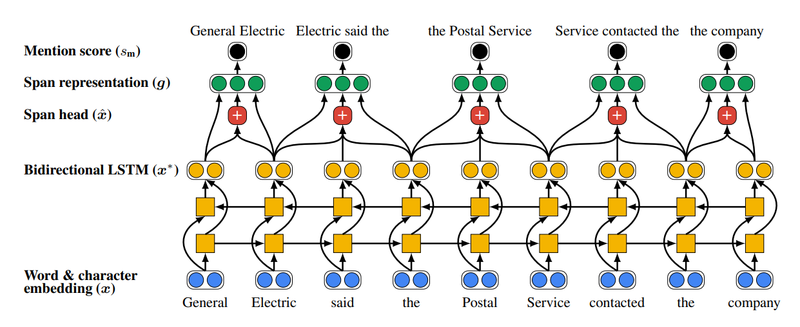
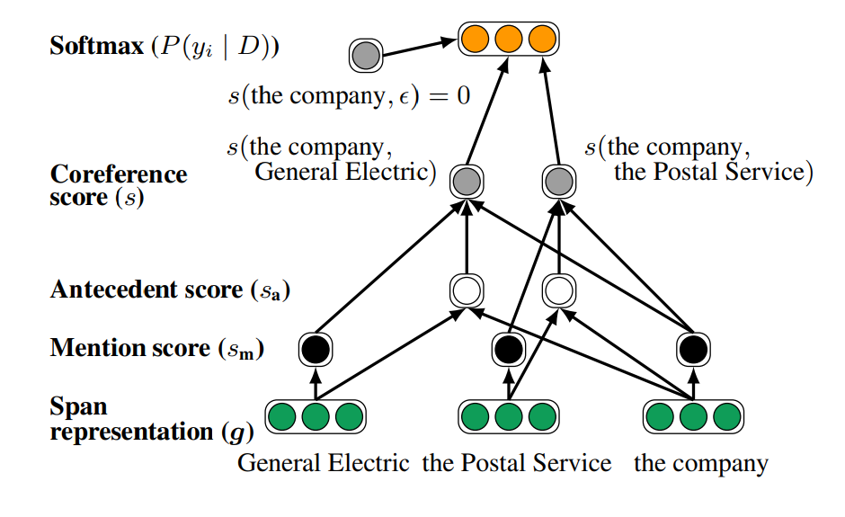

This repository contains PyTorch realisation of paper 
"End-to-end Neural Coreference Resolution"
by Kenton Lee et al. But you can use another embeddings for
tokens, like in "BERT for Coreference Resolution: Baselines
and Analysis" by Mandar Joshi et al. or "SpanBERT: 
Improving Pre-training by Representing and Predicting 
Spans" by Mandar Joshi et al. 

## Training instructions
<ul>
<li>Configuration file is <strong>config.yml</strong></li>
<li>Training: <code>python train.py</code></li>
</ul>

### Basic parameters
#### embedding_model
In initial method e2e-coref It was suggested training contextualized
embeddings for tokens in parallel with the main model; 
this is <strong>'untrained'</strong> option for this parameter. 
But you also can use pretrained embeddings like <strong>elmo</strong>
or <strong>bert</strong>.

#### max_segments
The document usually split into parts; it could be just
sentences(for untrained and elmo options) or segments of 
equal length(for bert). Anyway after computing span embeddings
all the spans of this document are in memory. That is memory
intensive, so we randomly truncate documents up to max_segments parts. 

#### max_span_len
Maximum span length.

#### max_top_antecedents
For every span model predict antecedent(one of previous mentions
from the same cluster), but it's quite expensive to consider
all the previous spans, so we limit it by this parameter.

### Custom embedders
If you need custom embedder you can create your own class
that inherits torch.nn.Module and word_embedders.BaseEmbedder
classes.

## Data
This realisation assumes using CONLL-2012 dataset from 
Datasets(https://huggingface.co/datasets/conll2012_ontonotesv5).
If you want to adapt it for your own dataset, you should
override 'tokenize_document' method for embedder you want to use.
This realisation don't use speaker information, so your dataset
must contain only text and coreference spans.
## Model
The model includes 2 main steps: finding all mentions and clustering
them. To do that the model consider all spans up to max_span_len
(hyperparameter), compute mention score for everyone (via 
feed-forward-neural-network), prune it by this
score. The spans that was leaved are assumed mentions.

Figure 1. First step of the model. Source: "End-to-end Neural Coreference Resolution"
by Kenton Lee et al.

Then for every span the model predict antecedent(previous mention
from the same cluster). After that we can build a chain of
antecedents, every chain is a cluster.
!
Figure 2. Model scheme. Source: "End-to-end Neural Coreference Resolution"
by Kenton Lee et al.

In e2e-coref model contextualized token embedding are computed
by 2-layer bidirectional LSTM

